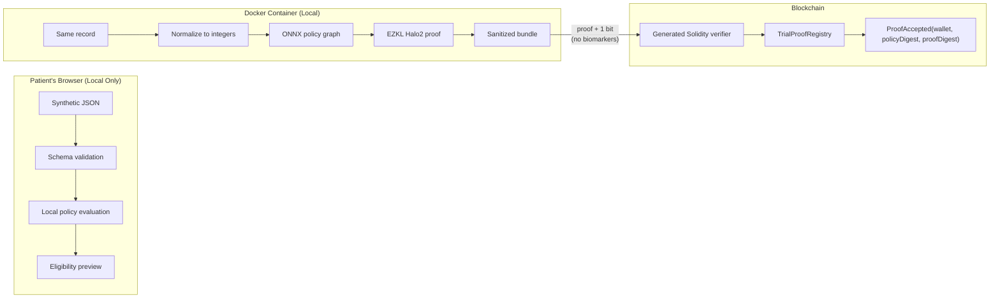

# VitaPod — Privacy-Preserving Clinical Trial Eligibility via zkML

A **local-first data pod** demonstrating that patients can cryptographically prove they meet clinical trial eligibility criteria **without revealing their biomarker values**. VitaPod compiles an ONNX eligibility policy to a Halo2 zk-SNARK via [EZKL](https://github.com/zkonduit/ezkl), verifies proofs on-chain through a generated Solidity verifier, and records only wallet addresses and digests in a replay-protected registry — the underlying health data never leaves the patient's device.

> [**EAG Global Buildathon 2026**](https://www.eaglobal.org/) — Track: **Local AI, Private AI & User-Owned Data**
>
> **Authors:** Diana Chang · Mehdi-Loup Nasom · Mariana Uchoa

## Track Fit

**EAG track — Local AI, Private AI & User-Owned Data.** The patient's health record is parsed, validated, and evaluated entirely client-side; the only thing that ever leaves the device is a zero-knowledge proof and a boolean result. That is user-owned data (the record never leaves the owner's control), private AI/inference (the eligibility policy is evaluated locally), and selective disclosure (a zk-SNARK reveals one bit, not the underlying values) — the three things this track explicitly calls out.

**HSK Chain track — qualification checklist:**

| Requirement | Status |
|---|---|
| Built on HSK Chain | ✅ `TrialProofRegistry` + generated `Halo2Verifier` target HashKey Chain |
| Deployed on HSK Chain (testnet accepted if time is limited) | ✅ Live on **Testnet** (chain `133`) — see [Live Deployment](#live-deployment) |
| Integrates HSK Chain technology | ✅ Registry/verifier deployed and proof-verified against it |
| GitHub repository | ✅ This repository |
| Working demo | ✅ Local Hardhat click-through demo; testnet contracts independently confirmed working |
| Project review / Demo Day | Scheduled for the buildathon's demo slot |

## Headline Result

| Metric | Value |
|--------|-------|
| **Proof generation** | 2.050 seconds |
| **On-chain verification** | 0.027 seconds |
| **Privacy guarantee** | Zero-knowledge: biomarkers never disclosed |
| **Data location** | 100% local (browser + container) |

The eligible synthetic record produces a valid proof that verifies on-chain; the registry emits only `ProofAccepted(wallet, policyDigest, proofDigest)`. No age, HbA1c, or eGFR values appear in the proof, transaction calldata, or event logs.

## Live Deployment

Beyond the local Hardhat demo path below, the registry and verifier are deployed, **source-verified**, and **independently confirmed working** on a public testnet.

| | |
|---|---|
| **Network** | HashKey Chain Testnet — chain ID `133` (RPC `https://testnet.hsk.xyz`) |
| **`Halo2Verifier`** | [`0x22ec2ee3c88632f5a9c03afc74cb4027a54255ab`](https://testnet-explorer.hskchain.net/address/0x22ec2ee3c88632f5a9c03afc74cb4027a54255ab?tab=contract) — ✅ fully verified |
| **`TrialProofRegistry`** | [`0xe4a8412d544cf515eb869164855f24bc4d4fefd9`](https://testnet-explorer.hskchain.net/address/0xe4a8412d544cf515eb869164855f24bc4d4fefd9?tab=contract) — ✅ fully verified |

**Confirmed via raw RPC/API calls, not just tool output:**

1. Both addresses carry deployed bytecode matching the compiled artifacts (verifier 14,798 bytes; registry 1,335 bytes).
2. `registry.verifier()` on-chain returns the deployed verifier address — the wiring is correct.
3. `registry.policyDigest()` on-chain equals `keccak256("vitapod-demo-metabolic-v1")`.
4. **A real committed proof (`prover/artifacts/eligible-proof.json`, generated by EZKL v23.0.5) was simulated against the deployed registry's `submit()` via `eth_call` and returned accepted, consuming 648,593 gas** — the actual zk-SNARK verification logic runs correctly on a public chain, not only against a local Hardhat node.
5. **Blockscout reports `is_fully_verified: true`** (not partial) for both contracts, compiled as `solc v0.8.28+commit.7893614a`, optimizer 200 runs, `cancun` EVM target. The source Blockscout serves back was independently re-hashed and matches the committed `contracts/contracts/generated/Halo2Verifier.sol` (SHA-256 `271d1c26…`) and `contracts/TrialProofRegistry.sol` (SHA-256 `857f93d8…`) byte-for-byte — the deployed bytecode, the verified explorer source, and the committed source are all provably the same file.

**Caveats, stated plainly:**

- Deployed from the well-known public Hardhat test account #1 (`0x70997970C51812dc3A010C7d01b50e0d17dc79C8`), funded with a small amount of testnet HSK for this purpose only. It's a shared, publicly-known test key — fine for a no-value testnet deployment, never appropriate for anything holding real funds.
- Mainnet (chain ID `177`) was deliberately **not** touched.

The local Hardhat path (chain `31337`) below remains the primary, network-independent demo — the testnet deployment is additional evidence that the identical, source-verified contracts work unmodified on a real chain.

## Report & Artifacts

- 📄 **Research paper (PDF):** [`report/vitapod-zkml-eligibility_paper.pdf`](report/vitapod-zkml-eligibility_paper.pdf) — full technical paper ([markdown source](report/vitapod-zkml-eligibility.md))
- 📊 **Pitch deck:** [`pitch/VitaPod_Pitch.pptx`](pitch/VitaPod_Pitch.pptx) — 19 slides, with per-slide speaker notes (live script + background/sources/Q&A)
- 🎬 **Live demo recording:** [`pitch/technical_demo.mp4`](pitch/technical_demo.mp4)
- 🎬 **Demo runbook:** [`docs/demo-runbook.md`](docs/demo-runbook.md)

*Additional pitch material (one-pager, speaker scripts, market-research notes) is in the parent [EAG_Buildathon](https://github.com/dyrtyData/EAG_Buildathon) repository, which stays private — the deck and demo video above are the versions judges can actually reach.*

## Why This Matters

**Patients will share health data for research — until they learn who receives it.**

| Recipient | Willing to Share |
|-----------|------------------|
| Treating physician | >95% |
| Academic researcher | 80–92% |
| **Pharmaceutical company** | **38–52%** |

*Source: Cascini et al., eClinicalMedicine 2024 — 116 studies, 228,501 participants*

Meanwhile, **~40% of NCI network trials fail to complete accrual**, and screen failures cost **$800–$2,500 per patient**. VitaPod demonstrates a cryptographic alternative: prove eligibility without disclosing the values.

## How It Works



**What stays private:** raw age, HbA1c, eGFR values; normalized inputs; the witness; the proving key
**What becomes public:** the eligibility result (1 bit), the proof bytes, the submitting wallet, transaction metadata

## Technical Architecture

| Layer | Technology | Purpose |
|-------|------------|---------|
| **Frontend** | React + Vite + Tailwind | Local-only data intake and preview |
| **Schema** | Zod (TypeScript) | Single source of truth for validation |
| **Proof Pipeline** | EZKL v23.0.5 + ONNX 1.19.1 | Compile policy to Halo2 zk-SNARK circuit |
| **Contracts** | Hardhat + generated Halo2Verifier | On-chain proof verification |
| **Registry** | TrialProofRegistry.sol | Replay protection + wallet binding |
| **Infrastructure** | Docker Compose (linux/arm64) | Reproducible containerized demo |

### Measured Performance (native arm64)

| Operation | Duration |
|-----------|----------|
| Setup (one-time) | 5.665 seconds |
| Prove (eligible) | 2.050 seconds |
| Verify (local) | 0.027 seconds |

## Project Phases

The build follows a structured progression from walking skeleton to full demonstration:

1. **Phase 1: Schema & Local Evaluation** — Zod schema mirroring ONNX policy; React preview; no network, no persistence.
2. **Phase 2: Browser Shell & Wallet** — Three-column UI with wallet integration (viem/wagmi); local evaluation only.
3. **Phase 3: Proof Pipeline** — EZKL setup, prove, verify inside pinned container; generated Solidity verifier.
4. **Phase 4: On-Chain Verification** — TrialProofRegistry with replay protection; wallet binding; event emission.
5. **Phase 5: Release Hardening** — CI scanner, lint, tests, acceptance evidence; production build validation.
6. **Phase 6: Documentation** — Research paper, pitch deck, demo runbook; reproducibility scripts.

## Quickstart

**Prerequisites:** Docker Desktop running. The host does not need Node, Python, or EZKL.

```bash
# Clone and build
git clone https://github.com/dyrtyData/VitaPod
cd VitaPod
docker compose build

# Generate proof (one-time setup + prove)
docker compose run --rm tools npm run prove:setup
docker compose run --rm tools npm run prove:eligible
docker compose run --rm tools npm run verify:local

# Start services
docker compose up -d chain web
docker compose run --rm tools npm run chain:deploy:local

# Open browser
open http://localhost:5173
```

### Demo Flow

1. **Load record** — Select `prover/fixtures/eligible.json`
2. **Import proof** — Import `prover/artifacts/eligible-proof.json`
3. **Connect wallet** — MetaMask to localhost:8545 (Chain ID 31337)
4. **Submit proof** — Observe `ProofAccepted` event
5. **Replay test** — Submit again → "Wallet already accepted"

See [`docs/demo-runbook.md`](docs/demo-runbook.md) for the full 3-minute presentation sequence.

## Repository Layout

```
VitaPod/
├── apps/
│   └── web/                  # React + Vite frontend
│       ├── src/
│       │   ├── components/   # Three-column UI components
│       │   ├── hooks/        # Wallet, proof, registry hooks
│       │   └── lib/          # Schema, policy evaluation
│       └── index.html
├── contracts/
│   ├── src/
│   │   ├── TrialProofRegistry.sol   # Replay protection + events
│   │   └── Halo2Verifier.sol        # EZKL-generated verifier
│   └── test/
├── prover/
│   ├── fixtures/             # Synthetic eligible/ineligible JSON
│   ├── artifacts/            # Generated proofs, keys, verifier
│   ├── models/               # ONNX policy graph
│   └── scripts/              # Python prove/verify pipeline
├── packages/
│   └── shared/               # Zod schema shared across frontend/prover
├── docs/
│   ├── architecture.md
│   ├── proof-feasibility.md
│   └── demo-runbook.md
├── report/                   # Research paper and figures
├── pitch/                    # Pitch deck (.pptx) and live-demo recording
├── scripts/
│   └── demo-smoke.sh         # Full regression test
├── docker-compose.yml
└── Dockerfile
```

## Reproducibility

Run the complete clean-worktree regression sequence:

```bash
bash scripts/demo-smoke.sh
```

This builds the native image, proves and verifies both fixtures, runs lint, tests, contract tests, the production build, and the release scanner. All artifacts are deterministically reproducible from the committed toolchain pins.

### Tests

```bash
# Inside container
docker compose run --rm tools npm test
docker compose run --rm tools npm run test:contracts
docker compose run --rm tools npm run lint
```

## Market Context

| Metric | Value | Source |
|--------|-------|--------|
| AI patient matching market | $641.6M → $1.9B by 2030 | Grand View Research |
| Privacy tokenization adoption | 270+ trials | Datavant |
| Screen failure rate | 20–80% by indication | Advarra |
| Cost per screen | $800–$2,500 | Industry average |

**Sponsors are already buying privacy infrastructure.** Datavant's tokenization is deployed across 2,000+ hospitals and top 30 pharma brands. Tokenization still requires a trusted intermediary to hold identifiers. **A zero-knowledge proof requires no one to hold anything.**

## Key Differentiators

1. **Real ZK proofs** — Not simulated; actual Halo2 zk-SNARKs verified on-chain
2. **Local-first** — Health data never leaves the browser or local container
3. **Reproducible** — Docker containerized; reviewers can rebuild from scratch
4. **Extensible** — ONNX model can be swapped without architecture changes
5. **DeSci-native** — Designed to integrate with IP-NFTs and DAOs

## Future Roadmap

| Phase | Capability |
|-------|------------|
| **Today** | Prove eligibility for a threshold policy |
| **Next** | Authenticated inputs — signed labs, FHIR provenance, zkTLS |
| **Then** | Scientific bounties — sponsor posts criteria on-chain; pod auto-claims |
| **Then** | Proof-of-contribution → drug discounts, priority access, compensation |
| **Later** | Validated phenotype models replacing thresholds |

## Boundaries

VitaPod is a **synthetic-data technical prototype**. It does not:

- Assess medical eligibility or replace investigator review
- Authenticate that data came from a lab or EHR
- Establish that a wallet maps to one person
- Obtain informed consent or enroll participants
- Establish HIPAA, FDA, or GDPR compliance

The proof establishes correct execution over a private witness. It does not establish the witness's real-world origin or authenticity.

## Team

| Name | Role | Background |
|------|------|------------|
| **Diana Chang** | AI Engineer, Project Lead | PharmD, MS Health IT |
| **Mehdi-Loup Nasom** | Blockchain/Web3 Developer | ENSC Ingénieur en Cognitique |
| **Mariana Uchoa** | Scientific Advisor | PhD Neuroscience (USC), Translational Immunology |

## License

- **Code:** MIT (see [`LICENSE`](LICENSE))
- **Report & figures:** CC-BY-4.0

## Citation

```bibtex
@misc{vitapod2026,
  title={VitaPod: Privacy-Preserving Clinical Trial Eligibility via Zero-Knowledge Machine Learning},
  author={Chang, Diana and Nasom, Mehdi-Loup and Uchoa, Mariana},
  year={2026},
  howpublished={EAG Global Buildathon},
  url={https://github.com/dyrtyData/VitaPod}
}
```

## Acknowledgments

VitaPod builds on [EZKL](https://github.com/zkonduit/ezkl) for zkML proof generation and the broader DeSci ecosystem pioneered by [Molecule](https://www.molecule.xyz/) and [VitaDAO](https://www.vitadao.com/).

---

*VitaPod is a synthetic-data technical prototype. It does not assess medical eligibility, authenticate laboratory results, enroll participants, or send health data to research sponsors. Do not use with real health records.*
