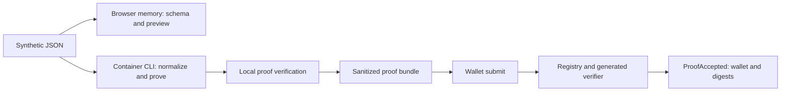

# Architecture

The browser has three deliberately separated views:

| View | Data handling |
| --- | --- |
| Stays in this browser | The selected synthetic JSON is parsed with the strict shared schema, evaluated for a preview, and kept in React memory. No upload, analytics, or browser persistence is used. |
| Local proof artifact | The CLI-generated bundle contains a proof, public eligibility output, and reproducibility metadata. It omits the source record, normalized input, witness, and proving key. |
| Public chain metadata | The registry verifies the exact generated verifier arguments and emits the submitter, policy digest, and proof digest. It does not store or emit source values or public-instance arrays. |

## Container topology

`docker compose` uses one checksum-pinned native `linux/arm64` image for Node, Python,
the official EZKL CLI, Hardhat, tests, and the Vite build. The `tools` service runs one-shot
commands. `web` exposes Vite on `localhost:5173`; `chain` exposes Hardhat JSON-RPC on
`localhost:8545`. The repository bind mount makes generated local proof artifacts available

The proof policy is deterministic: adult age, an illustrative HbA1c interval, and an
illustrative eGFR threshold. The shared TypeScript evaluator, integer ONNX graph, and
registry public-output check are tested mirrors of that policy.
